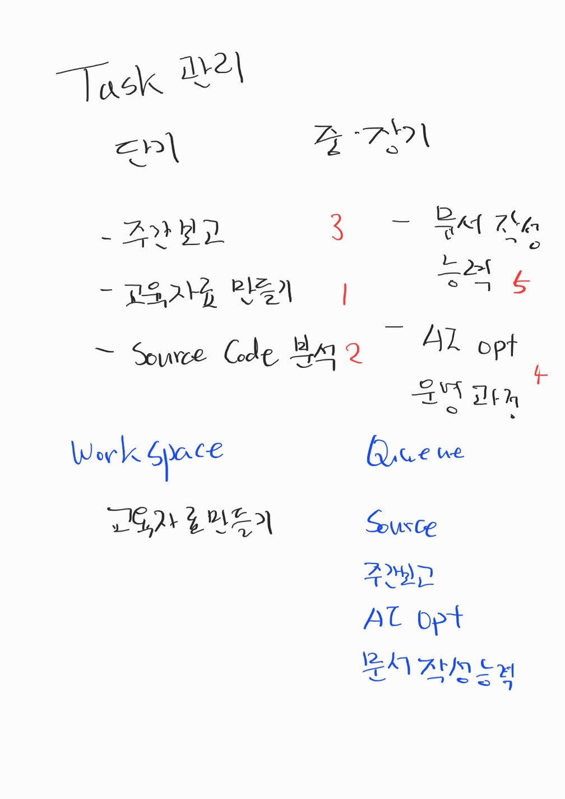

# 2월 1주 스터디
- [2월 1주 스터디](#2월-1주-스터디)
  - [업무 관리 방법](#업무-관리-방법)
    - [Task 업무 관리 비법](#task-업무-관리-비법)
  - [IT System 운영](#it-system-운영)
    - [Resource 모니터링](#resource-모니터링)
      - [모니터링 대상](#모니터링-대상)
      - [cpu 모니터링](#cpu-모니터링)
      - [메모리 모니터링](#메모리-모니터링)
      - [디스크 모니터링](#디스크-모니터링)
    - [시스템 점검 방법](#시스템-점검-방법)
      - [resource 점검](#resource-점검)
      - [Known Case](#known-case)
  
## 업무 관리 방법 
### Task 업무 관리 비법
> 업무 task 의 완결 및 중단기 과제 수행을 위해 효율적인 task관리 방법 필요. 
> 
> 개인적인 관리 비법이며, 각자 환경에 따라 맞게 수행한다.
- Task 관리 전략
  - Task 에 대해 due date로 기간별 Task로 관리한다.
  - Task 의 우선순위를 매겨 진행 한다.
    - 짧은 시간에 처리 완료 할수 있는 task는 높은 우선순위를 가지며 긴급도에 따라 우선순의를 매긴다.
  - Task 는 한번에 하나씩 집중하여 최 단기 시간에 처리를 완료한다.
  - 진행해야 하는 Task는 우선순위에 따라 순차로 처리한다.
  - 진행 대기 Task를 작은 단위로 유지한다. (대략 3~4개 작을 수록 관리 유리)
  - Task진행시 interrupt 로 들어오는 업무는 기존 task완료 이후에 처리한다.
  - Task 완료에 다른 사람의 작업이 필요한 경우 Async call back 형태로 진행한다.
  - 하루동안에 처리할수 있는 task의 갯수에 대해 파악하고 개인의 업무 수행능력의 재한범위를 파악한다.
- 실행예제
-  

## IT System 운영
### Resource 모니터링
> 시스템은 한정적인 자원을 사용하며, 자원의 현재 사용에 문제가 있는지에 대해서 모니터링 해야 한다. 

#### 모니터링 대상 
- cpu
- memory
- disk
#### cpu 모니터링 
> cpu의 사용추이를 모니터링해야 하며, cpu의 사용은 실제적 ap의 처리에 많은 영향은 주지 않는다. 하지만 100%를 계속 사용하고 있다고 하면 cpu의 사용을 어느 프로세스에서 마니 사용하고 있는지를 모니터링 한다.
> 
> 정상적인 ap 사용시에도 cpu사용량이 높은 상태를 유지한다고 하면 시스템 자원이 작은 경우일수 있으니, 시스템 자원 증설이 필요할 수 있다.
#### 메모리 모니터링 
- 메모리는 leak발생의 가능성이 있기 때문에 유심히 사용량을 확인해야 한다.

- 메모리 사용량이 어느 시점 이후 계속 증가 한다고 하면 leak의 패턴일 가능성이 있다. 메모리의 중복 사용이나, 회수 하지 않는 메모리등

- ap의 형태에 따라 메모리 사용 형태가 다를수 있다. 예) python의 경우 자체적 데이터 구조가 메모리를 과다하게 사용할수 있는 케이스가 있따.
- java 의 메모리 사용이 과다할 경우 heapdump를 통해 메모리 사용 형태를 분석 할수 있다 
- java 의 과다한 메모리 사용시에는 Full GC(Garbage Collect)를 유발하여 시스템 이상현상의 원인이 될수 있다. Full GC시에는 Stop the world발생
#### 디스크 모니터링 
- Disk IO는 상당히 느린 작업으로 시스템의 성능에 영향을 줄 수 있다. 
  - 운영환경에서 log level을 높게 유지(INFO WARN ERROR) 하는 이유는 성능에 영향을 줄수 있기 때문에 Disk IO를 작게 유지한다.
- Disk IO 및 Disk 사용량에 대한 모니터링을 진행한다.
- AP에서는 느린 속도를 개선하기 위한 방법의 고려가 필요할수 있다.(회피, Cache등 )

### 시스템 점검 방법
- TOP 
  - tool의 사용법에 대해서는 인터넷 검색이 가능하지만, 시스템마다 버젼이 상이하고 다를 수 있기 때문에 시스템에서 "man top" 매뉴얼 페이지를 통해 확인하는 걸 권고 한다.
  - case 마다 사용법에 대한 숙지가 필요하다.
  - 상위는 시스템의 현재 summary정보를 표기하며, 하위는 현재 시스템의 runtime 프로세스 정보를 표기한다.
  - 많이 사용하는 접근 방법
    - user 별 process 확인
      - top에서 user 입력 후 검색할 user 를 입력하면, 해당 유저의 프로세스만 검색 된다.
    - Full command: top에서는 명령어만 일반적으로 나오기 때문에 프로세스를 식별하기 위해서 Full command 를 사용하여 확인한다. 
      - 시스템 마다 다르지만 'C'입력시 full command를 제공한다.
    - Sorting 
      - cpu 사용량, memory 사용량 별로 sorting해서 볼수 있다.
    - thread 모드 
      - Thread dump분석시 thread mode 로 보면 tid로 확인 가능하다.

#### resource 점검
#### Known Case